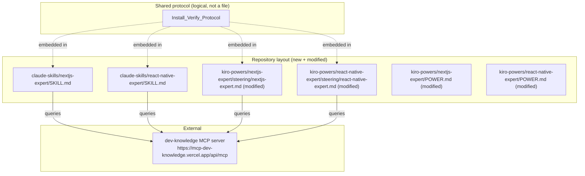

# Design Document

## Overview

This feature creates two Claude Code Skills mirroring the existing Kiro Powers (Next.js / Vercel Expert and React Native Expert) and adds an Install_Verify_Protocol to all four persona artifacts. The result is four parallel persona definitions — two Kiro steering files and two Claude SKILL.md files — all backed by the same `dev-knowledge` MCP server and sharing a consistent verification-and-install flow.

**Key design decisions:**

1. **Claude Code MCP registration uses `claude mcp add --transport http`** — Claude Code stores MCP config in `~/.claude.json` (user scope) or `.mcp.json` (project scope). The install walk-through guides users through the CLI command rather than manual JSON editing, since that's the official path.
2. **Install_Verify_Protocol uses `list_knowledge_filters` (no `stack` arg) as the reachability probe** — it's the cheapest call, requires no input, and a successful response proves the server is up and authenticated.
3. **SKILL.md files replicate the full persona body** — Claude Skills are self-contained; they cannot reference external steering files. Each SKILL.md carries the complete persona instructions including Lookup Protocol, Similar-entries pivot, Gap Capture, and Fallback Label sections inherited from the peer spec.
4. **Parity is structural, not byte-for-byte** — the two Next.js artifacts and the two React Native artifacts share identical protocol logic; only stack values, domain coverage wording, and host-specific install snippets differ.

## Architecture



The Install_Verify_Protocol is not a shared file — it is a textual block duplicated (with stack-appropriate values) into all four persona artifacts. This avoids cross-file dependencies that neither Kiro nor Claude Code supports for steering/skill resolution.

## Components and Interfaces

### 1. Claude Skill: `claude-skills/nextjs-expert/`

**Files:**
- `SKILL.md` — single file, YAML frontmatter + markdown body

**YAML frontmatter:**
```yaml
---
name: nextjs-expert
description: Senior Next.js (App Router) and Vercel engineer backed by the dev-knowledge MCP server. Queries the nextjs-vercel knowledge base before answering Next.js, Vercel, or App Router questions. Use when debugging Next.js errors, choosing patterns, configuring Vercel deployments, or working with Prisma/Neon, Drizzle/Turso, Supabase, Upstash, or Inngest in a Next.js context.
---
```

**Body sections (in order):**
1. Persona introduction (senior Next.js engineer role)
2. Stack scoping (Active_Stack = `nextjs-vercel`, Forbidden_Stack = `react-native`)
3. **Install_Verify_Protocol** (Claude Code variant)
4. How to use the MCP tools
5. Answering style
6. Domain coverage
7. Lookup protocol (carried from peer spec)
8. Similar-entries pivot (carried from peer spec)
9. Gap Capture (carried from peer spec)
10. Fallback Label (carried from peer spec)

### 2. Claude Skill: `claude-skills/react-native-expert/`

**Files:**
- `SKILL.md` — identical structure to the Next.js variant, differing only in:
  - `name: react-native-expert`
  - `description:` references React Native / Expo
  - Active_Stack = `react-native`, Forbidden_Stack = `nextjs-vercel`
  - Domain coverage lists React Native technologies
  - Knowledge file path = `knowledge/react-native.json`

### 3. Modified Kiro Steering: `kiro-powers/nextjs-expert/steering/nextjs-expert.md`

**Addition:** An `## Install_Verify_Protocol` section inserted after the `## Stack scoping (critical)` section and before `## How to use the MCP tools`. Contains the Kiro-host variant of the protocol (references `~/.kiro/settings/mcp.json` and `.kiro/settings/mcp.json`).

**Preserved:** YAML frontmatter (`inclusion: manual`), all existing sections, all existing tool names, the prohibition on fabricating entry ids.

### 4. Modified Kiro Steering: `kiro-powers/react-native-expert/steering/react-native-expert.md`

**Addition:** Same `## Install_Verify_Protocol` section as above, differing only in stack values and knowledge file path.

### 5. Modified POWER.md files

Both `kiro-powers/nextjs-expert/POWER.md` and `kiro-powers/react-native-expert/POWER.md` receive a brief note in the "How to use" section mentioning that the steering now verifies MCP server reachability on first activation. No structural changes.

### Install_Verify_Protocol — shared logic

The protocol is the same across all four artifacts modulo host-specific install instructions and stack values:

```
## Install_Verify_Protocol

On the first question of a session, before composing a substantive answer:

1. Call `list_knowledge_filters` (no arguments needed) to probe MCP_Server reachability.
2. If the call succeeds → the server is reachable. Proceed to answer. Skip re-verification for the rest of the session.
3. If the call fails with a transport error (server not registered) → surface the issue and offer the install walk-through (see below).
4. If the call fails with HTTP 401 → inform the user that MCP_API_KEY is missing or invalid; guide them through setting the env var and restarting the host.
5. If the user declines installation (Decline_Decision) → continue on general expertise for the session; defer labeling to the Fallback Label rule. Do not re-prompt about installation on subsequent questions.
```

**Kiro-host install snippet (inside Kiro steering files):**
```json
// Add to ~/.kiro/settings/mcp.json (user-global) or .kiro/settings/mcp.json (workspace)
{
  "mcpServers": {
    "dev-knowledge": {
      "url": "https://mcp-dev-knowledge.vercel.app/api/mcp",
      "headers": {
        "Authorization": "Bearer ${MCP_API_KEY}"
      }
    }
  }
}
```

**Claude-Code-host install snippet (inside Claude SKILL.md files):**
```bash
claude mcp add --transport http dev-knowledge https://mcp-dev-knowledge.vercel.app/api/mcp \
  --header "Authorization: Bearer $MCP_API_KEY" \
  --scope user
```

Alternatively, manual JSON in `~/.claude.json` under `mcpServers`:
```json
{
  "mcpServers": {
    "dev-knowledge": {
      "type": "http",
      "url": "https://mcp-dev-knowledge.vercel.app/api/mcp",
      "headers": {
        "Authorization": "Bearer ${MCP_API_KEY}"
      }
    }
  }
}
```

### Stack isolation during verification

- The probe call (`list_knowledge_filters` with no `stack` argument) does not violate stack isolation because it queries metadata, not knowledge entries.
- Any subsequent tool call in the session MUST pass the Active_Stack value. The Forbidden_Stack value is never passed on any call.

## Data Models

This feature introduces no new data models. It operates exclusively on markdown/YAML documentation files. The existing knowledge entry schema, MCP tool schemas, and `power.json` structure remain unchanged.

**File inventory (additions and modifications):**

| Path | Action | Notes |
|------|--------|-------|
| `claude-skills/nextjs-expert/SKILL.md` | Create | New Claude Skill |
| `claude-skills/react-native-expert/SKILL.md` | Create | New Claude Skill |
| `kiro-powers/nextjs-expert/steering/nextjs-expert.md` | Modify | Add Install_Verify_Protocol section |
| `kiro-powers/react-native-expert/steering/react-native-expert.md` | Modify | Add Install_Verify_Protocol section |
| `kiro-powers/nextjs-expert/POWER.md` | Modify | Mention verification in "How to use" |
| `kiro-powers/react-native-expert/POWER.md` | Modify | Mention verification in "How to use" |

No files outside this set are touched. `power.json` files, `app/`, `lib/`, `knowledge/`, `export-to-neon.mjs`, and all config files remain unmodified.

## Error Handling

Since this is a documentation/configuration-only feature, "error handling" refers to the behavioral instructions embedded in the persona artifacts:

1. **MCP server not registered (transport error):** The Install_Verify_Protocol instructs the agent to offer the host-appropriate installation walk-through. The agent does not silently degrade.

2. **HTTP 401 (auth failure):** The protocol instructs the agent to tell the user that `MCP_API_KEY` is missing or invalid, guide them to set the environment variable, and restart the host.

3. **User declines installation:** The agent continues answering on general expertise. Labeling defers to the Fallback Label rule from the peer spec (`[ungrounded — general expertise]`). The agent does not block, refuse, or repeatedly prompt.

4. **Verification already succeeded this session:** The agent skips re-verification. No repeated probe calls.

5. **Ambiguous failure (e.g., timeout):** Treated as Server_Unavailable — same flow as transport error.

## Testing Strategy

This feature is documentation-only. There is no application code to unit-test or property-test. Property-based testing does not apply because there are no functions, parsers, serializers, or data transformations — only static markdown content.

**Verification approach:**

1. **Manual review checklist** — confirm each acceptance criterion from requirements 1–11 is satisfied by inspecting the produced files:
   - YAML frontmatter structure and values
   - Section ordering (Install_Verify_Protocol before Lookup Protocol)
   - Stack values in each artifact
   - Parity between Next.js and React Native variants (diff should show only stack-specific tokens)
   - Preservation of existing frontmatter and sections

2. **Git-based scope verification** — after applying the feature, run `git status --porcelain` and confirm only permitted paths appear (per Requirement 11, criterion 7).

3. **Structural diff** — diff the two SKILL.md files against each other; the delta should contain only stack-specific values (`nextjs-vercel` vs `react-native`, domain coverage wording, knowledge file path). Same for the Install_Verify_Protocol sections of the two steering files.

4. **Smoke test (manual)** — activate each persona in its respective host and confirm the verification probe fires on first question, succeeds when the server is registered, and offers the install walk-through when the server is not registered.

PBT is not applicable: there are no pure functions or input-varying logic to exercise.
