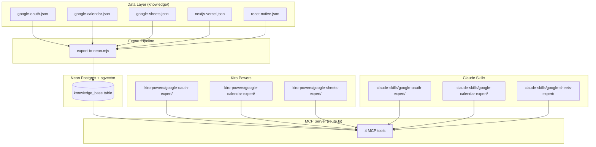
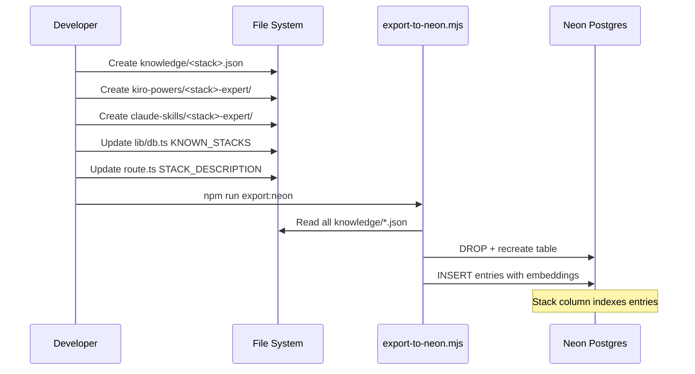
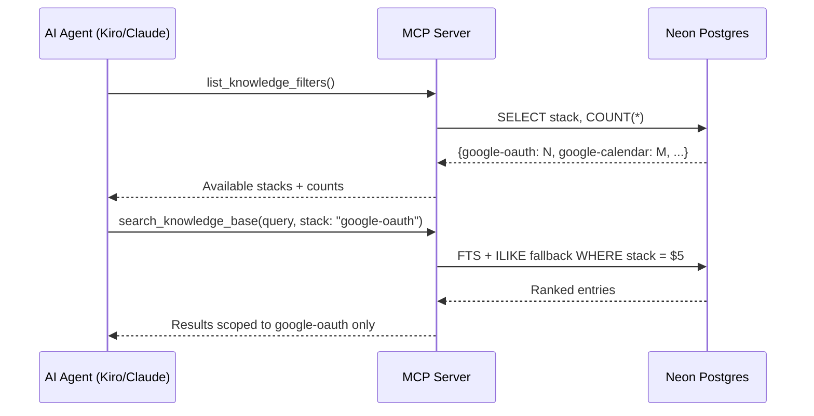

# Design Document: Google API Experts

## Overview

Add three new strictly-isolated knowledge stacks — `google-oauth`, `google-calendar`, and `google-sheets` — each backed by its own knowledge JSON file, Kiro Power, and Claude Skill. The existing `nextjs-vercel` stack already contains Google API entries that should be duplicated (not moved — the originals stay in place for Next.js context) into dedicated, framework-agnostic stacks. This makes the knowledge reusable by any project using Google APIs, not just Next.js apps.

The change is primarily data + persona artifacts. The only code change is updating `KNOWN_STACKS` in `lib/db.ts` and the stack description strings in `route.ts` and `app/page.tsx` so agents discover the new stacks.

## Architecture



## Sequence Diagrams

### Stack Addition Workflow



### Agent Lookup Flow (per-stack)



## Components and Interfaces

### Component 1: Knowledge JSON Files

**Purpose**: Store curated entries per stack as the single source of truth.

**Interface** (per entry, same schema as existing):
```typescript
interface KnowledgeEntry {
  type: string;       // bug_fix | error | config_issue | code_pattern | best_practice | fix_snippet | performance_case | doc | recipe | ...
  symptoms: string[]; // natural-language search targets
  root_cause: string; // concise explanation
  fix: string[];      // ordered fix steps
  tags: string[];     // filterable tags
  severity: "low" | "medium" | "high";
  frequency: "rare" | "occasional" | "common" | "very-common";
  related_docs: string[];  // reference URLs
  version: string | null;  // applicable version range
  stack: string;           // "google-oauth" | "google-calendar" | "google-sheets"
}
```

**Responsibilities**:
- One file per stack: `knowledge/google-oauth.json`, `knowledge/google-calendar.json`, `knowledge/google-sheets.json`
- Entries are framework-agnostic (no NextAuth-specific code — that stays in `nextjs-vercel`)
- Each file is a JSON array of entries

### Component 2: KNOWN_STACKS + Descriptions (lib/db.ts, route.ts)

**Purpose**: Register new stacks so MCP tools surface them to agents.

**Interface change** (TypeScript):
```typescript
// lib/db.ts
export const KNOWN_STACKS = [
  "nextjs-vercel",
  "react-native",
  "google-oauth",
  "google-calendar",
  "google-sheets",
] as const;
```

**Responsibilities**:
- `KNOWN_STACKS` in `lib/db.ts` — used for validation error messages
- `STACK_DESCRIPTION` in `route.ts` — agent-facing description listing all valid stacks
- `instructions` in `route.ts` serverInfo — brief overview of all stacks
- `app/page.tsx` — landing page lists available stacks

### Component 3: Kiro Powers (one per stack)

**Purpose**: Persona artifact that wires a Kiro agent to the MCP server scoped to one stack.

**File structure per power**:
```
kiro-powers/<stack>-expert/
├── POWER.md          # Overview, MCP tools, stack isolation, miss handling
├── power.json        # name, displayName, keywords, mcpServers config, steering ref
└── steering/
    └── <stack>-expert.md  # Install_Verify_Protocol, Lookup Protocol, Gap Capture, Fallback Label
```

**Interface** (`power.json` shape):
```typescript
interface PowerJson {
  name: string;            // e.g. "google-oauth-expert"
  displayName: string;     // e.g. "Google OAuth Expert"
  version: string;         // "1.0.0"
  description: string;     // agent-facing, mentions stack name
  keywords: string[];      // activation triggers
  author: string;          // "mcp-dev-knowledge"
  license: string;         // "ISC"
  steering: string[];      // ["steering/<stack>-expert.md"]
  mcpServers: {
    "dev-knowledge": {
      url: string;         // "https://mcp-dev-knowledge.vercel.app/api/mcp"
      headers: { Authorization: string };
      disabled: boolean;
      autoApprove: string[];
    }
  }
}
```

### Component 4: Claude Skills (one per stack)

**Purpose**: Persona artifact for Claude Code agents, equivalent to the Kiro Power.

**File structure**:
```
claude-skills/<stack>-expert/
└── SKILL.md   # YAML frontmatter (name, description) + full persona instructions
```

**Interface** (YAML frontmatter):
```yaml
---
name: <stack>-expert          # e.g. "google-oauth-expert"
description: <agent summary>  # mentions stack, MCP server, domain coverage
---
```

**Responsibilities**:
- Same persona behavior as the Kiro steering file
- Includes: Stack scoping, Install_Verify_Protocol, Lookup Protocol, Similar-entries pivot, Gap Capture, Fallback Label
- Install walk-through uses `claude mcp add` command

## Data Models

### Knowledge Entry Topics by Stack

**google-oauth** — framework-agnostic Google OAuth knowledge:
| Tag cluster | Topics |
|-------------|--------|
| `consent-screen` | Verification, test users, publishing status |
| `scopes` | Scope selection, incremental auth, sensitive vs restricted |
| `token-refresh` | Refresh token flow, expiration handling, silent refresh |
| `token-persistence` | DB storage patterns, encryption at rest |
| `redirect-uri` | Configuration, mismatch debugging, localhost vs production |
| `service-account` | Setup, domain-wide delegation, when to use |

**google-calendar** — Google Calendar API knowledge:
| Tag cluster | Topics |
|-------------|--------|
| `events` | List, create, update, delete events |
| `webhooks` | Push notifications, watch channels, sync tokens |
| `timezone` | Handling, conversion, all-day events |
| `rate-limiting` | Quotas, backoff, caching strategies |
| `recurring-events` | RRULE, instances, exceptions |
| `permissions` | 403 debugging, scope verification |

**google-sheets** — Google Sheets API knowledge:
| Tag cluster | Topics |
|-------------|--------|
| `read-data` | values.get, batchGet, ranges |
| `write-data` | update, append, batchUpdate, clear |
| `batch-operations` | Efficient multi-range operations |
| `service-account` | Server-side access without user OAuth |
| `sheets-as-cms` | Pattern for lightweight data source |
| `permissions` | 403 debugging, sharing with service accounts |

### Validation Rules

- Every entry MUST have `stack` matching the filename (enforced by export script)
- `severity` ∈ {"low", "medium", "high"}
- `frequency` ∈ {"rare", "occasional", "common", "very-common"}
- `symptoms` array MUST be non-empty
- `fix` array MUST be non-empty
- `tags` array MUST be non-empty
- Entries are framework-agnostic: no NextAuth/Prisma/Next.js-specific code (that belongs in `nextjs-vercel`)

## Key Functions with Formal Specifications

### Function 1: KNOWN_STACKS update

```typescript
export const KNOWN_STACKS = [
  "nextjs-vercel", "react-native",
  "google-oauth", "google-calendar", "google-sheets",
] as const;
```

**Preconditions:**
- Each value is a valid stack name matching a `knowledge/<stack>.json` file

**Postconditions:**
- `searchKnowledge()` error message lists all known stacks when `stack` param missing
- No behavioral change to existing stacks

### Function 2: STACK_DESCRIPTION update

```typescript
const STACK_DESCRIPTION =
  "REQUIRED. Which tech stack to scope this query to. Stacks are STRICTLY ISOLATED — " +
  "a query returns entries from exactly one stack and never mixes them. " +
  "Valid values: 'nextjs-vercel' (Next.js App Router + Vercel), 'react-native' " +
  "(React Native for web/Android/iOS), 'google-oauth' (Google OAuth sign-in, scopes, " +
  "token refresh), 'google-calendar' (Google Calendar API events, webhooks, sync), " +
  "'google-sheets' (Google Sheets API read/write, batch ops, Sheets-as-CMS). " +
  "If unsure which stacks exist, call list_knowledge_filters FIRST.";
```

**Preconditions:**
- String is used as Zod `.describe()` on the `stack` param of `search_knowledge_base`

**Postconditions:**
- Agents can discover all five stacks from the tool description alone
- Existing `nextjs-vercel` and `react-native` descriptions unchanged in substance

### Function 3: Power/Skill persona scoping

Each persona artifact MUST:

```typescript
// In steering/SKILL, the stack scoping section:
// Active_Stack: exactly one of "google-oauth" | "google-calendar" | "google-sheets"
// ALWAYS pass stack: "<active-stack>" to search_knowledge_base
// NEVER query any other stack
```

**Preconditions:**
- Agent has the power/skill activated
- MCP server is reachable

**Postconditions:**
- All `search_knowledge_base` calls use the correct `stack` value
- No cross-stack contamination

## Algorithmic Pseudocode

### Knowledge Extraction Algorithm

```pascal
ALGORITHM extractAndAdaptEntries(sourceStack, targetStack, tagFilter)
INPUT: sourceStack: "nextjs-vercel", targetStack: one of new stacks, tagFilter: primary tag
OUTPUT: entries[] for the new stack JSON file

BEGIN
  sourceEntries ← loadJSON("knowledge/" + sourceStack + ".json")
  extracted ← []

  FOR each entry IN sourceEntries DO
    IF tagFilter IN entry.tags THEN
      adaptedEntry ← deepCopy(entry)
      adaptedEntry.stack ← targetStack

      // Remove framework-specific content
      adaptedEntry.fix ← removeNextjsSpecifics(adaptedEntry.fix)
      adaptedEntry.symptoms ← generalizeSymptomsForStack(adaptedEntry.symptoms)
      adaptedEntry.tags ← removeTag(adaptedEntry.tags, "next-auth")
      adaptedEntry.tags ← removeTag(adaptedEntry.tags, "nextjs")

      extracted.add(adaptedEntry)
    END IF
  END FOR

  // Add new entries not in source (stack-specific deep knowledge)
  newEntries ← createStackSpecificEntries(targetStack)
  extracted.addAll(newEntries)

  RETURN extracted
END
```

**Note**: This is a conceptual algorithm for the manual curation process. The actual extraction is done by hand since entries need human judgment for framework-agnostic adaptation.

## Example Usage

### Adding a new stack (developer workflow)

```bash
# 1. Create knowledge file
# knowledge/google-oauth.json — array of curated entries

# 2. Create Kiro Power
# kiro-powers/google-oauth-expert/power.json
# kiro-powers/google-oauth-expert/POWER.md
# kiro-powers/google-oauth-expert/steering/google-oauth-expert.md

# 3. Create Claude Skill
# claude-skills/google-oauth-expert/SKILL.md

# 4. Update code references
# lib/db.ts — add to KNOWN_STACKS
# app/api/[transport]/route.ts — update STACK_DESCRIPTION + instructions

# 5. Deploy knowledge
npm run export:neon

# 6. Verify
npx @modelcontextprotocol/inspector
# → call list_knowledge_filters() → see google-oauth in stacks list
# → call search_knowledge_base({query: "token refresh", stack: "google-oauth"})
```

### Agent interaction after deployment

```typescript
// Agent calls (via MCP):
const filters = await listKnowledgeFilters();
// → stacks: [{value: "google-oauth", count: 12}, {value: "google-calendar", count: 10}, ...]

const results = await searchKnowledgeBase({
  query: "refresh token expired",
  stack: "google-oauth",
  limit: 5,
});
// → results scoped to google-oauth only, never calendar/sheets entries
```

## Correctness Properties

*A property is a characteristic or behavior that should hold true across all valid executions of a system — essentially, a formal statement about what the system should do. Properties serve as the bridge between human-readable specifications and machine-verifiable correctness guarantees.*

### Property 1: Stack field matches filename

*For any* entry in any of the three new knowledge files (`google-oauth.json`, `google-calendar.json`, `google-sheets.json`), the entry's `stack` field SHALL equal the filename-derived stack identifier (e.g., entries in `google-oauth.json` must have `stack: "google-oauth"`).

**Validates: Requirements 1.3, 2.3, 3.3**

### Property 2: Schema compliance for all new entries

*For any* entry in any of the three new knowledge files, the entry SHALL have non-empty `symptoms`, `fix`, and `tags` arrays, a `severity` value in the set {`low`, `medium`, `high`}, and a `frequency` value in the set {`rare`, `occasional`, `common`, `very-common`}.

**Validates: Requirements 1.6, 2.6, 3.6**

### Property 3: Framework-agnostic content

*For any* entry in any of the three new knowledge files, the `fix` and `symptoms` arrays SHALL NOT contain NextAuth-specific, Prisma-specific, or Next.js-specific terms (e.g., `"NextAuth"`, `"next-auth"`, `"prisma"`, `"next/`", `"getServerSideProps"`).

**Validates: Requirements 1.5, 2.5, 3.5**

### Property 4: Stack isolation on search results

*For any* search query executed with `stack: S` where S is one of the five known stacks, every entry in the result set SHALL have `entry.stack === S`.

**Validates: Requirements 12.1, 12.2, 12.3**

### Property 5: Invalid stack error message completeness

*For any* string that is not in the set of valid stacks, calling `searchKnowledge` with that string as the `stack` argument SHALL produce an error message that mentions all five valid stack names.

**Validates: Requirements 13.3**

### Property 6: Install_Verify_Protocol precedes Lookup Protocol

*For all* six new persona artifacts (three steering files and three skill files), the `Install_Verify_Protocol` section heading SHALL appear before the `Lookup protocol` section heading in document order.

**Validates: Requirements 19.2**

### Property 7: Gap Capture references correct knowledge file

*For each* of the six new persona artifacts, the Gap Capture template SHALL reference `knowledge/<active-stack>.json` where `<active-stack>` matches the persona's Active_Stack value.

**Validates: Requirements 19.3**

### Property 8: Fallback Label literal consistency

*For all* six new persona artifacts, the document SHALL contain the exact literal string `[ungrounded — general expertise]` as the Fallback Label.

**Validates: Requirements 19.4**

## Error Handling

### Error Scenario 1: Unknown stack passed to search_knowledge_base

**Condition**: Agent passes `stack: "google-oauth"` before export is run
**Response**: `searchKnowledge()` returns empty results (stack filter yields 0 rows). The error message in the thrown error lists `KNOWN_STACKS`.
**Recovery**: Run `npm run export:neon` to load the new knowledge into the database.

### Error Scenario 2: Power installed but MCP server unreachable

**Condition**: User installs a Google API expert power but hasn't configured MCP_API_KEY or server is down
**Response**: Install_Verify_Protocol in steering detects failure on `list_knowledge_filters()` call
**Recovery**: Guided install walk-through in the steering file

### Error Scenario 3: Entries duplicated with wrong stack value

**Condition**: Entry has `"stack": "nextjs-vercel"` but is in `knowledge/google-oauth.json`
**Response**: `export-to-neon.mjs` falls back to filename-derived stack (`entry.stack || stackFromName`), so it would use the entry's explicit `stack` — wrong.
**Recovery**: Ensure all entries in `google-oauth.json` have `"stack": "google-oauth"` explicitly set. The export script uses `entry.stack` if present.

## Testing Strategy

### Manual Verification Checklist

1. Run `npm run export:neon` — no errors, prints count per file including new stacks
2. Call `list_knowledge_filters()` — all 5 stacks appear with correct counts
3. Call `search_knowledge_base({query: "token refresh", stack: "google-oauth"})` — returns results
4. Call `search_knowledge_base({query: "token refresh", stack: "google-calendar"})` — returns no OAuth results (isolation)
5. Call `search_knowledge_base({query: "list events", stack: "google-calendar"})` — returns calendar results
6. Call `search_knowledge_base({query: "append rows", stack: "google-sheets"})` — returns sheets results
7. Existing queries against `nextjs-vercel` and `react-native` produce same results as before

### Persona Artifact Verification

1. Install each Kiro Power → activate → verify `list_knowledge_filters` call succeeds
2. Each steering file's `Active_Stack` matches the expected stack string
3. Gap Capture template references the correct `knowledge/<stack>.json` filename
4. Keywords in `power.json` are relevant and don't overlap excessively with other stacks

## Performance Considerations

- Adding 3 stacks with ~10-15 entries each adds ~30-45 rows to the database — negligible impact
- The IVFFlat index (`lists = 20`) remains appropriate for the total row count
- Full-text search with `WHERE stack = $5` is covered by the existing `idx_kb_stack` B-tree index
- No additional indexes needed

## Security Considerations

- No new environment variables or secrets introduced
- Knowledge entries contain no secrets (only public URLs and code patterns)
- MCP_API_KEY auth mechanism unchanged
- Service account patterns in entries describe the concept; no actual credentials stored

## Dependencies

- No new npm packages
- No schema changes to the `knowledge_base` table
- No changes to `export-to-neon.mjs` (it already reads all `knowledge/*.json` files)
- Existing `mcp-handler`, `zod`, `@neondatabase/serverless` remain as-is
