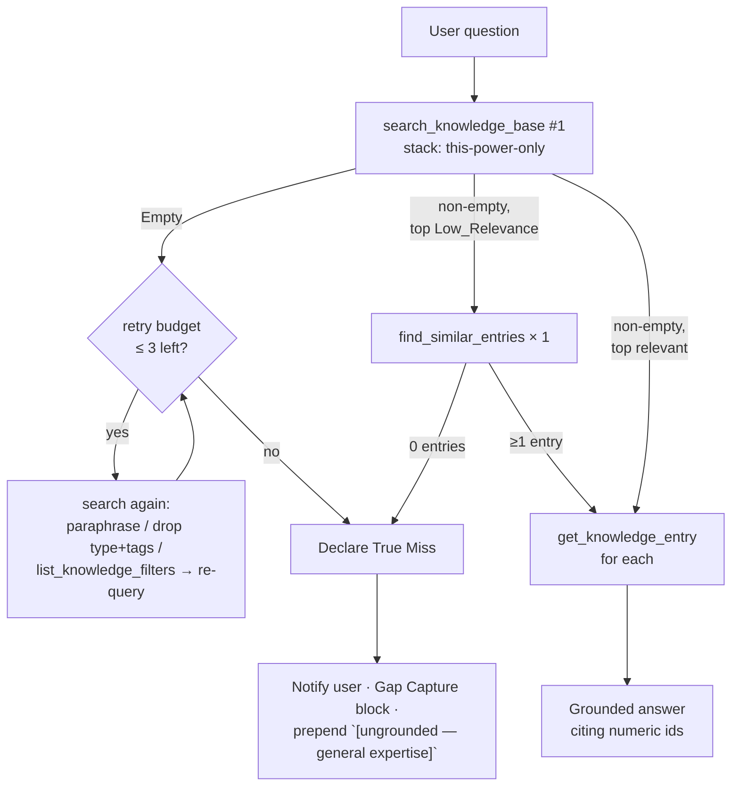

# Design Document

## Overview

This is a **documentation-only** change. We harden the lookup protocol of the two existing Kiro powers by appending four parallel sections to each steering file and one small "Knowledge-base miss handling" section to each `POWER.md`. No code, knowledge data, or build script is touched.

The two steering files are kept in lock-step. Inside the new sections, every byte is identical between the two files except for two enumerated token pairs:

- the stack identifier `nextjs-vercel` ↔ `react-native`
- the knowledge file path `knowledge/nextjs-vercel.json` ↔ `knowledge/react-native.json`

Because the path string contains the stack id, a single global substitution `s/nextjs-vercel/react-native/g` against the nextjs file's new-sections region MUST yield the react-native file's new-sections region byte-for-byte.

Pre-existing content (front matter, intro, `## Stack scoping (critical)`, `## How to use the MCP tools`, `## Answering style`, `## Domain coverage`) stays verbatim in each file. New sections are appended **after all pre-existing content**.

The smallest change that satisfies all 7 requirements is therefore:

- 4 new appended sections in each steering file (8 sections total, two-by-two parity).
- 1 new appended section in each POWER.md.
- No other modifications, anywhere.

## Architecture

### Files in scope (writable)

| Path | Action |
|------|--------|
| `kiro-powers/nextjs-expert/steering/nextjs-expert.md` | Append 4 sections after the existing `## Domain coverage`. |
| `kiro-powers/react-native-expert/steering/react-native-expert.md` | Append 4 sections after the existing `## Domain coverage` (token-swapped from nextjs version). |
| `kiro-powers/nextjs-expert/POWER.md` | Append 1 section after the existing `## Stack isolation`. |
| `kiro-powers/react-native-expert/POWER.md` | Append 1 section after the existing `## Stack isolation` (token-swapped from nextjs version). |

### Files explicitly out of scope

Every other file in the repo. Specifically:

- `app/**`, `lib/**`, `knowledge/**`, `export-to-neon.mjs`
- `package.json`, `package-lock.json`, `next.config.mjs`, `vercel.json`, `tsconfig.json`
- `README.md`, `.env`, `.env.example`, `.gitignore`
- `.kiro/**` (this spec excepted), `node_modules/**`

These remain byte-for-byte identical to their pre-change state. Verified post-change via `git status --porcelain`.

### Final structure of each steering file

Order, top to bottom (sections 1–7 unchanged; sections 8–11 appended):

```
1.  YAML front matter:       ---\ninclusion: manual\n---
2.  # <stack-specific title>                                  (pre-existing)
3.  <stack-specific intro paragraph>                          (pre-existing)
4.  ## Stack scoping (critical)                               (pre-existing)
5.  ## How to use the MCP tools                               (pre-existing)
6.  ## Answering style                                        (pre-existing)
7.  ## Domain coverage                                        (pre-existing)
8.  ## Lookup protocol                                        (NEW)
9.  ## Similar-entries pivot                                  (NEW)
10. ## Gap Capture                                            (NEW)
11. ## Fallback Label                                         (NEW)
```

### Final structure of each POWER.md

```
1. # <stack-specific title>            (pre-existing)
2. <intro paragraph>                   (pre-existing)
3. ## What it does                     (pre-existing)
4. ## MCP server                       (pre-existing)
5. ### Tools exposed                   (pre-existing, nested under "MCP server")
6. ## How to use                       (pre-existing)
7. ## Stack isolation                  (pre-existing)
8. ## Knowledge-base miss handling     (NEW)
```

### Lookup flow (information only)



### Parity rule

For the new-sections region of each steering file (everything from the first character of the `## Lookup protocol` heading through end-of-file):

```
sed 's/nextjs-vercel/react-native/g' <new-sections of nextjs file>
  ==
<new-sections of react-native file>      (byte-for-byte)
```

The path-pair (`knowledge/nextjs-vercel.json` ↔ `knowledge/react-native.json`) is subsumed by the stack-pair substitution because the path embeds the stack id. No second pass is needed.

### Pre/post diff strategy proving R5.8 parity and R7.7 scope containment

Two checks, both runnable as a one-liner. Together they discharge requirements 5.8 and 7.7:

```bash
# 5.8 — Parity inside new sections (region-scoped)
awk '/^## Lookup protocol$/,0' kiro-powers/nextjs-expert/steering/nextjs-expert.md \
  | sed 's/nextjs-vercel/react-native/g' \
  | diff - <(awk '/^## Lookup protocol$/,0' kiro-powers/react-native-expert/steering/react-native-expert.md)
# Expected: empty diff

# 7.7 — Scope containment
git status --porcelain \
  | grep -vE '^.. kiro-powers/(nextjs-expert|react-native-expert)/(steering/[^/]+\.md|POWER\.md)$' \
  | grep -vE '^.. \.kiro/specs/knowledge-base-miss-handling/'
# Expected: empty output
```

(The second filter excludes the spec directory itself, since authoring the spec is permitted. R7 lists `.kiro/` as out-of-scope for the *implementation*, not for the spec authoring step.)

## Components and Interfaces

The change is purely textual. Each new section maps to one feature requirement:

| Section (heading text) | Requirement | Purpose |
|------------------------|-------------|---------|
| `## Lookup protocol` | R1 | Numbered protocol. Step 1 = `search_knowledge_base` with the file's stack. Retry cap 3 (4 total). Inline True Miss definition. Stack isolation extended to retries. |
| `## Similar-entries pivot` | R2 | Two-clause Low_Relevance definition. One `find_similar_entries` call before True Miss. `get_knowledge_entry` to expand. Zero-results → True Miss with no fabricated id. |
| `## Gap Capture` | R3 | Block label, field template, constrained value sets for `severity` and `frequency`, user-edits-the-JSON rule, no-self-write rule. |
| `## Fallback Label` | R4 | The literal label string and prepend rules for ungrounded answers. |
| `## Knowledge-base miss handling` (in POWER.md) | R6 | Surfaces only the two user-visible behaviors (Fallback Label + Gap Capture block). |

### Exact final text — steering file new sections (nextjs version)

The block below is the literal markdown to append to `kiro-powers/nextjs-expert/steering/nextjs-expert.md` after its existing `## Domain coverage` section. The react-native version is produced by `s/nextjs-vercel/react-native/g`.

The literal text is shown inside a four-backtick fence so the embedded three-backtick fences and indented code block render correctly in this design doc:

````markdown
## Lookup protocol

Run this protocol on every question that could be grounded in this stack's knowledge base, before answering from general expertise. Every call below MUST pass `stack: "nextjs-vercel"`; never query any other stack at any step or in any retry.

1. Call `search_knowledge_base` with `stack: "nextjs-vercel"` and the user's question (or the error text) as `query`. Do not set `type` or `tags` on the first attempt.
2. If the response is an Empty Result (results array length is 0 or `structuredContent.count` is 0), retry `search_knowledge_base` using at least one of: a paraphrased `query`, dropping `type` and `tags` filters, or first calling `list_knowledge_filters` with `stack: "nextjs-vercel"` to discover the available vocabulary and re-querying with adjusted filters.
3. Make at most 3 additional `search_knowledge_base` calls (4 total including step 1). After this cap is reached and every call has returned an Empty Result, declare a True Miss — that is the inline definition of True Miss for this protocol.
4. If a non-empty response is Low_Relevance per the next section, follow the similar-entries pivot before declaring a True Miss.
5. On a True Miss: notify the user that no vetted answer was found in the `nextjs-vercel` knowledge base, fall back to general knowledge to answer, and never query any stack other than `nextjs-vercel`. Also emit the Gap Capture block (see below) and prepend the Fallback Label (see below).

## Similar-entries pivot

A `search_knowledge_base` result is **Low_Relevance** when the top returned entry satisfies at least one of:

- (a) the top entry's `root_cause` and `fix` do not address the symptoms in the user's question, or
- (b) the top entry's tags overlap the question by no more than one tag.

When `search_knowledge_base` returns at least one result and the top entry is Low_Relevance:

1. Call `find_similar_entries` exactly once, using the `id` of the top returned entry, before declaring a True Miss.
2. If `find_similar_entries` returns one or more entries, expand each by calling `get_knowledge_entry` with that entry's `id` before grounding any answer in it.
3. If `find_similar_entries` returns zero entries, declare a True Miss — do not invoke `get_knowledge_entry` and never fabricate an entry `id`.

## Gap Capture

When the Lookup Protocol terminates in a True Miss, emit — in the same response that announces the True Miss — a single contiguous block labeled exactly `Gap Capture` proposing a candidate new entry for `knowledge/nextjs-vercel.json`. Use the template below verbatim, filling each field from what you learned during the failed lookup:

    Gap Capture
    - type: <one of: bug_fix | error | config_issue | code_pattern | best_practice | fix_snippet | performance_case | doc | recipe | diagnostic_step | root_cause | anti_pattern | architecture | convention | checklist | log_pattern>
    - symptoms:
      - <symptom 1>
      - <symptom 2>
    - root_cause: <one or two sentences>
    - fix:
      - <step 1>
      - <step 2>
    - tags: [<tag1>, <tag2>]
    - severity: <one of: low | medium | high>
    - frequency: <one of: rare | occasional | common | very-common>
    - stack: "nextjs-vercel"

Rules for the block:

- The `severity` value MUST be one of `low`, `medium`, `high`. The `frequency` value MUST be one of `rare`, `occasional`, `common`, `very-common`. The `stack` value MUST be the literal string `"nextjs-vercel"`.
- If you lack the information to propose a concrete value for any required field, write `<NEEDS USER INPUT>` for that field instead of fabricating a value.
- Tell the user the candidate must be added to `knowledge/nextjs-vercel.json` by them, and that they must then run `npm run export:neon` to load it into Neon.
- Never create, write to, or modify `knowledge/nextjs-vercel.json` yourself. The Gap Capture block is the only output; the user owns the edit.

## Fallback Label

The exact wording of the Fallback Label is the literal string `[ungrounded — general expertise]`. Use it verbatim — no translation, no paraphrase, no casing change, no whitespace change.

Rules:

- An answer is **grounded** when it cites at least one numeric `id` returned verbatim by a `dev-knowledge` MCP tool call made in the same turn. Any other answer is **ungrounded**.
- When you produce an ungrounded answer, prepend the Fallback Label as the very first characters of your response — no leading whitespace, no markdown, no other formatting before it.
- When you produce a grounded answer, do NOT prepend the Fallback Label.
- Never cite an `id` that was not returned verbatim by a `dev-knowledge` MCP tool call in the current turn. Fabricated ids are forbidden.
- If a `dev-knowledge` MCP tool call in the current turn returns an empty result set, treat the answer as ungrounded, prepend the Fallback Label, and cite no `id`.
- If a `dev-knowledge` MCP tool call in the current turn fails or returns an error, treat the answer as ungrounded, prepend the Fallback Label, and cite no `id`.
````

The react-native version of the four sections above is generated by `sed 's/nextjs-vercel/react-native/g'`. No other token differs.

### Exact final text — POWER.md addition (nextjs version)

Append to `kiro-powers/nextjs-expert/POWER.md` after its existing `## Stack isolation` section. The react-native version is produced by `s/nextjs-vercel/react-native/g`.

````markdown
## Knowledge-base miss handling

The steering hardens what the agent does when the knowledge base does not match:

- Ungrounded answers are prefixed with `[ungrounded — general expertise]`. An answer is grounded only when it cites a numeric `id` returned in the same turn by a `dev-knowledge` tool call.
- On a True Miss (after retries and a similar-entries pivot all fail to ground an answer), the agent emits a `Gap Capture` block proposing a candidate new entry for `knowledge/nextjs-vercel.json`. The agent never writes to that file itself — adopt the proposal by editing the JSON manually and running `npm run export:neon`.
````

R6.1/6.2 mandate this addition (the Fallback Label and Gap Capture block are user-visible behaviors). R6.3/6.4 mandate that the pre-existing `## MCP server`, `### Tools exposed`, and `## Stack isolation` sections stay byte-identical — the new section is appended, never inlined.

## Data Models

This change introduces no runtime data models. Two textual artifacts act as data:

### Fallback Label literal

The single canonical literal, used in both steering files unchanged (no token swap):

```
`[ungrounded — general expertise]`
```

It is non-empty, enclosed in backticks, and used verbatim by the agent (R4.3/4.4).

### Gap Capture template

Lives in the steering file as an indented (4-space) code block — chosen over fenced code to avoid nesting three-backtick fences inside the markdown.

| Field | Type | Constraint |
|-------|------|-----------|
| `type` | enum string | one of `bug_fix`, `error`, `config_issue`, `code_pattern`, `best_practice`, `fix_snippet`, `performance_case`, `doc`, `recipe`, `diagnostic_step`, `root_cause`, `anti_pattern`, `architecture`, `convention`, `checklist`, `log_pattern` (mirrors `list_knowledge_filters` output described in `lib/db.ts` and `.kiro/steering/structure.md`) |
| `symptoms` | bullet list of strings | ≥ 1 bullet |
| `root_cause` | string | one or two sentences |
| `fix` | bullet list of strings | ≥ 1 bullet |
| `tags` | comma-separated list inside `[ ]` | informal |
| `severity` | enum | one of `low`, `medium`, `high` |
| `frequency` | enum | one of `rare`, `occasional`, `common`, `very-common` |
| `stack` | literal string | `"nextjs-vercel"` (or `"react-native"` in the react-native version) |

Unknown fields are filled with `<NEEDS USER INPUT>` rather than fabricated (R3.9/3.10).

The `severity` and `frequency` enums mirror the knowledge-entry schema documented in `.kiro/steering/structure.md`. The `type` enum mirrors the values returned by `list_knowledge_filters`.


## Correctness Properties

*A property is a characteristic or behavior that should hold true across all valid executions of a system — essentially, a formal statement about what the system should do. Properties serve as the bridge between human-readable specifications and machine-verifiable correctness guarantees.*

This is a documentation-only change. The "system" is a fixed set of four markdown files; there is no runtime input space. Property-based testing in the runtime sense (random input + assertion) does not apply — there are no inputs. Instead, each property below is a deterministic static check over the four files, runnable as a one-line shell command. They are still expressed as universal statements ("for all bytes of region R, …", "for both steering files, …") so the parity and scope claims are machine-verifiable.

### Property 1: Gap Capture template completeness

*For all* steering files in `{nextjs-expert, react-native-expert}`, the body of the `## Gap Capture` section names each of the required fields `type`, `symptoms`, `root_cause`, `fix`, `tags`, `severity`, `frequency`, `stack`, AND lists every value of the `severity` enum (`low`, `medium`, `high`) AND every value of the `frequency` enum (`rare`, `occasional`, `common`, `very-common`).

**Validates: Requirements 3.3, 3.4**

### Property 2: Fallback Label literal parity

*For both* steering files, the `## Fallback Label` section contains exactly one backticked literal that defines the Fallback Label, that literal is non-empty, and the literal extracted from the nextjs file is byte-equal to the literal extracted from the react-native file.

**Validates: Requirements 4.3, 4.4**

### Property 3: Steering parity after token substitution

*For all* bytes of the new-sections region (from the start of `## Lookup protocol` through end-of-file) of the nextjs steering file, applying the substitution `nextjs-vercel → react-native` globally yields a byte-stream byte-equal to the new-sections region of the react-native steering file. Equivalently, `sed 's/nextjs-vercel/react-native/g'` of the nextjs region piped into `diff` against the react-native region produces empty output.

**Validates: Requirements 5.1, 5.2, 5.8**

### Property 4: Pre-existing steering content is preserved and new sections come last

*For each* steering file, the pre-change region (everything before `## Lookup protocol`) is byte-equal to its pre-change snapshot (captured via `git show HEAD:<path>` taken before this change, then sliced to the same prefix), AND the byte offset of `## Lookup protocol` is strictly greater than the byte offset of `## Domain coverage` (i.e., the new sections appear after all pre-existing sections in document order).

**Validates: Requirements 5.2, 5.3, 5.4, 5.5, 5.6, 5.7, 7.5**

### Property 5: POWER.md is preserved with a single appended section

*For each* `POWER.md` in `{nextjs-expert, react-native-expert}`, the pre-change region (everything before `## Knowledge-base miss handling`) is byte-equal to its pre-change snapshot, AND the new `## Knowledge-base miss handling` section is present and mentions both the Fallback Label string and the Gap Capture block.

**Validates: Requirements 6.1, 6.2, 6.3, 6.4, 6.5, 6.6, 6.7, 6.8**

### Property 6: Scope containment

*For all* paths reported by `git status --porcelain` (with output filtered to exclude `.kiro/specs/knowledge-base-miss-handling/`, which is the workflow's own spec directory), the path matches the regex `^kiro-powers/(nextjs-expert|react-native-expert)/(steering/[^/]+\.md|POWER\.md)$`. Any path not matching this regex is a scope violation and the change set MUST be reverted.

**Validates: Requirements 7.1, 7.2, 7.3, 7.4, 7.6, 7.7**

## Error Handling

The product itself has no new error paths — no code is added. Three classes of "errors" matter for *this change-set*, all caught by the property checks above:

| Error class | Detection | Recovery |
|-------------|-----------|----------|
| Parity drift between the two steering files | Property 3 (`sed | diff`) | Re-derive react-native file from nextjs file via global substitution; replay. |
| Pre-existing content was edited or reordered | Property 4 / Property 5 (byte-equality vs `git show HEAD:<path>`) | `git checkout HEAD -- <path>` then re-append only the new sections. |
| A file outside the permitted four was modified | Property 6 (`git status --porcelain` filter) | Revert the offending file with `git checkout HEAD -- <path>`. |

Steering also instructs the agent (at runtime) to treat MCP tool errors as ungrounded answers (R4.10). This is a documentation rule, not a code path. It is verified by inspecting the new `## Fallback Label` section.

## Testing Strategy

This is a documentation-only change. There is no runtime; therefore PBT in the random-input sense does not apply. The Testing Strategy is six deterministic verification commands, each pinned to one of the six correctness properties.

### Verification plan

Run from the repo root after applying the change. All six checks must pass.

```bash
# P1 — Gap Capture template completeness
# Each required label and every constrained enum value must appear in each steering file's "## Gap Capture" section.
for f in kiro-powers/nextjs-expert/steering/nextjs-expert.md \
         kiro-powers/react-native-expert/steering/react-native-expert.md; do
  body=$(awk '/^## Gap Capture$/,/^## Fallback Label$/' "$f")
  for needle in 'type:' 'symptoms:' 'root_cause:' 'fix:' 'tags:' \
                'severity:' 'frequency:' 'stack:' \
                'low' 'medium' 'high' \
                'rare' 'occasional' 'common' 'very-common'; do
    grep -qF -- "$needle" <<<"$body" || { echo "P1 FAIL: '$needle' missing in $f"; exit 1; }
  done
done

# P2 — Fallback Label literal parity
ns=$(grep -oP '`[^`]+`' kiro-powers/nextjs-expert/steering/nextjs-expert.md \
     | awk '/ungrounded/{print; exit}')
rn=$(grep -oP '`[^`]+`' kiro-powers/react-native-expert/steering/react-native-expert.md \
     | awk '/ungrounded/{print; exit}')
[ -n "$ns" ] && [ "$ns" = "$rn" ] || { echo "P2 FAIL: label mismatch ($ns vs $rn)"; exit 1; }

# P3 — Steering parity after token substitution
diff <(awk '/^## Lookup protocol$/,0' kiro-powers/nextjs-expert/steering/nextjs-expert.md \
       | sed 's/nextjs-vercel/react-native/g') \
     <(awk '/^## Lookup protocol$/,0' kiro-powers/react-native-expert/steering/react-native-expert.md) \
  || { echo "P3 FAIL: parity diff non-empty (see above for first differing line)"; exit 1; }

# P4 — Pre-existing steering content preserved + new sections appended last
for f in kiro-powers/nextjs-expert/steering/nextjs-expert.md \
         kiro-powers/react-native-expert/steering/react-native-expert.md; do
  # 4a: byte-equal prefix vs HEAD
  diff <(git show "HEAD:$f") \
       <(awk 'BEGIN{p=1} /^## Lookup protocol$/{p=0} p{print}' "$f") \
    || { echo "P4 FAIL: pre-existing region of $f drifted from HEAD"; exit 1; }
  # 4b: ordering — Lookup protocol appears after Domain coverage
  dc=$(grep -n '^## Domain coverage$' "$f" | head -1 | cut -d: -f1)
  lp=$(grep -n '^## Lookup protocol$' "$f" | head -1 | cut -d: -f1)
  [ -n "$dc" ] && [ -n "$lp" ] && [ "$lp" -gt "$dc" ] \
    || { echo "P4 FAIL: ordering wrong in $f (dc=$dc lp=$lp)"; exit 1; }
done

# P5 — POWER.md preservation + appended section
for f in kiro-powers/nextjs-expert/POWER.md \
         kiro-powers/react-native-expert/POWER.md; do
  diff <(git show "HEAD:$f") \
       <(awk 'BEGIN{p=1} /^## Knowledge-base miss handling$/{p=0} p{print}' "$f") \
    || { echo "P5 FAIL: pre-existing region of $f drifted"; exit 1; }
  body=$(awk '/^## Knowledge-base miss handling$/,0' "$f")
  grep -qF 'ungrounded' <<<"$body" || { echo "P5 FAIL: $f missing Fallback Label mention"; exit 1; }
  grep -qF 'Gap Capture' <<<"$body" || { echo "P5 FAIL: $f missing Gap Capture mention"; exit 1; }
done

# P6 — Scope containment
git status --porcelain \
  | awk '{print substr($0,4)}' \
  | grep -vE '^\.kiro/specs/knowledge-base-miss-handling/' \
  | grep -vE '^kiro-powers/(nextjs-expert|react-native-expert)/(steering/[^/]+\.md|POWER\.md)$' \
  | { ! read line || { echo "P6 FAIL: out-of-scope path '$line'"; exit 1; }; }

echo "OK — all six correctness properties hold."
```

Each requirement maps to at least one runnable check above; conversely, no check is added without a requirement to back it. Because Property 3 enforces parity, every per-file textual EXAMPLE check from prework (R1.1–R1.12, R2.1–R2.8, R3.1–R3.10, R4.1–R4.10) only needs to be inspected on one file — Property 3 propagates the result to the other.

### What is intentionally NOT tested

- **Runtime agent behavior.** Whether the agent actually follows the steering at runtime is not testable from this repo. Steering files are agent prompts; their effect is observed in agent transcripts, not unit tests.
- **MCP tool semantics.** No tool was changed (R7.4); the existing tools are already exercised by the deployed server and their tests live elsewhere.
- **Performance of retries.** The retry cap (R1.7/1.8) is a textual instruction; runtime retry behavior is the agent's responsibility.

These exclusions follow directly from the documentation-only nature of the change and from `ponytail.md`'s "best code is the code never written" — adding test infrastructure for a markdown edit would be pure boilerplate.

## Verification Plan (reviewer-facing)

Quick checklist for a reviewer, mapped to each requirement:

| Requirement | How to verify |
|-------------|---------------|
| R1.1–R1.12 | Read the `## Lookup protocol` section in `nextjs-expert.md` (P3 propagates to the other file). Confirm: ordered list, step 1 names `search_knowledge_base` + correct stack, retry strategies enumerated, retry cap "3 additional / 4 total" stated, inline True Miss definition present, stack-isolation extended to retries, True Miss → notify-fallback-no-other-stack. |
| R2.1–R2.8 | Read `## Similar-entries pivot`. Confirm two-clause Low_Relevance definition, "exactly once" `find_similar_entries`, expansion via `get_knowledge_entry`, zero-results → True Miss with no fabricated id. |
| R3.1–R3.10 | Read `## Gap Capture`. Confirm block label, all 8 required fields, `severity` enum (3 values), `frequency` enum (4 values), correct stack literal, edit-target file + `npm run export:neon`, no-self-write rule, `<NEEDS USER INPUT>` placeholder rule. |
| R4.1–R4.10 | Read `## Fallback Label`. Confirm the literal `[ungrounded — general expertise]` is backticked, prepend rule for ungrounded, no-prepend for grounded, no-fabricated-id rule, empty-result and tool-error treatment. |
| R5.1, 5.2, 5.7, 5.8 | Run the P3 `sed | diff` one-liner. Empty diff → pass. |
| R5.3, 5.4 | Run `head -3` on each steering file; confirm `---\ninclusion: manual\n---`. |
| R5.5, 5.6 | Run the P4 prefix `diff` against `git show HEAD:<file>`. Empty diff → pass. |
| R6.1, 6.2 | `grep '^## Knowledge-base miss handling$' kiro-powers/*/POWER.md` finds two hits; section body mentions both `ungrounded` and `Gap Capture`. |
| R6.3, 6.4, 6.5, 6.6, 6.7, 6.8 | P5 prefix-equality check. |
| R7.1, 7.2, 7.3, 7.4, 7.6, 7.7 | P6 `git status --porcelain` filter check. |
| R7.5 | Subsumed by P4 prefix-equality (front-matter is in the prefix). |

### POWER.md update decision (R6 conditional)

Both steering files acquire two user-visible behaviors: the Fallback Label and the Gap Capture block. R6.1/6.2 mandate that each `POWER.md` describe these in the same change set, and R6.7/6.8 say the change set is incomplete otherwise. Therefore both `POWER.md` files MUST be updated.

The minimal compliant edit, per `ponytail.md` ("deletion over addition, fewest files possible"): a single new section appended at the end of each POWER.md, mirroring the structure of the steering edit. Pre-existing sections (`## What it does`, `## MCP server` + `### Tools exposed`, `## How to use`, `## Stack isolation`) stay byte-identical (R6.3/6.4/6.5/6.6, enforced by P5).

The literal text of the new POWER.md section is given in the **Components and Interfaces** section above.
